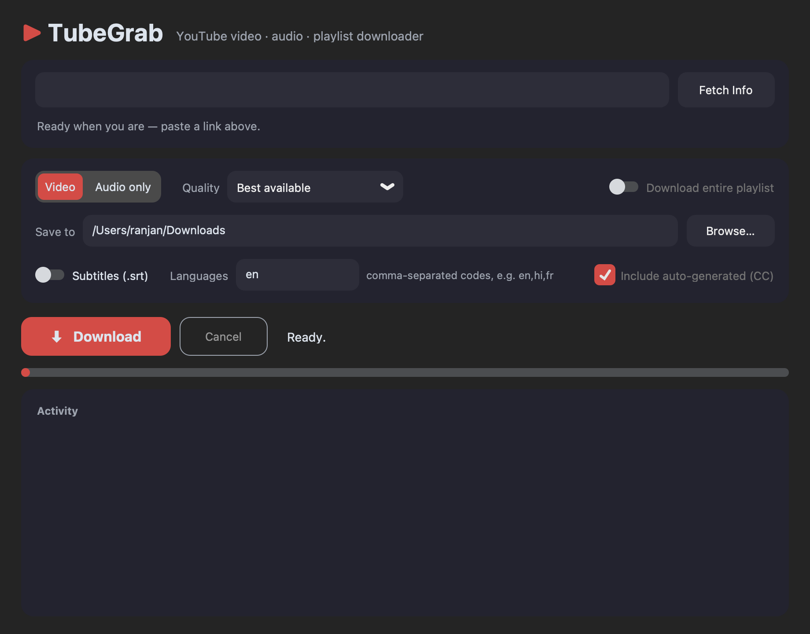
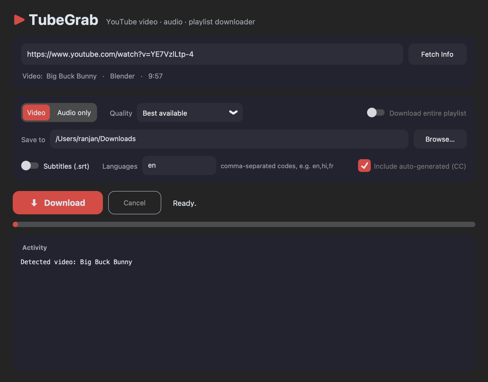
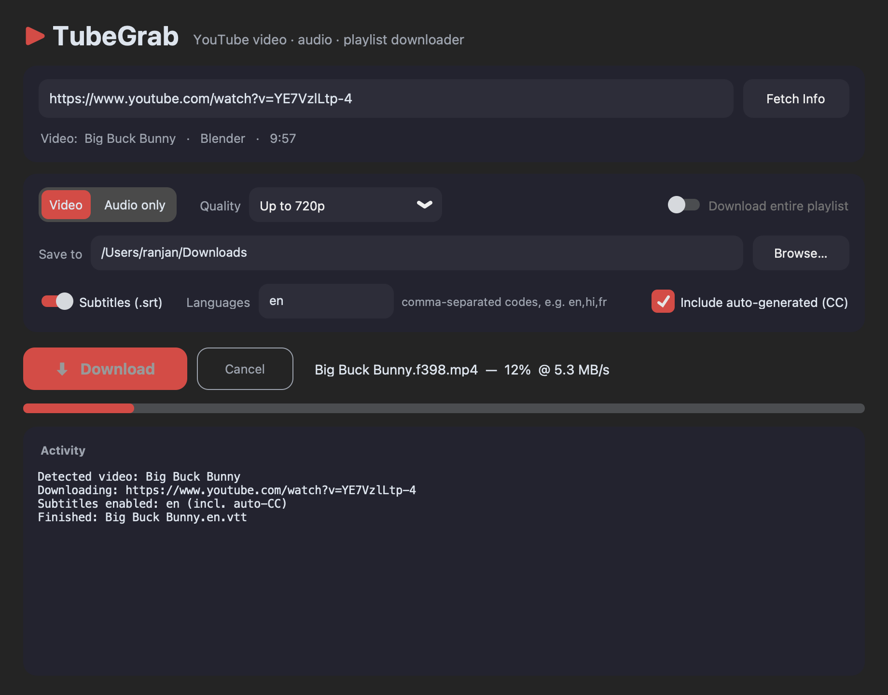

# TubeGrab

A sleek, dark-mode desktop GUI for downloading YouTube **videos**, **audio**, and **entire playlists** — powered by [yt-dlp](https://github.com/yt-dlp/yt-dlp) with a modern [customtkinter](https://github.com/TomSchimansky/CustomTkinter) interface. Paste a URL, pick your quality, hit Download.

## Screenshots

**Main window** — paste a URL, choose Video or Audio-only, pick a quality, choose where to save:



**Fetch Info** — detects whether the URL is a single video or a playlist and shows title, channel, and duration (playlists show the video count and enable the "Download entire playlist" option):



**Downloading** — live progress bar with per-file percentage and download speed, plus a cancel button:



## Features

- **Modern dark UI** — rounded cards, segmented controls, and a red accent theme (customtkinter)
- **Video downloads** with quality caps: Best available, 4K, 1080p, 720p, 480p (merged to `.mp4`)
- **Audio-only downloads**: best original format, MP3 320/192 kbps, or M4A (AAC)
- **Subtitles (.srt)** — grab manual subtitles and/or YouTube's auto-generated captions (CC) in any languages (`en,hi,fr,…`), converted to `.srt` with ffmpeg
- **Playlist support** — auto-detected from the URL; saves into a folder named after the playlist with numbered files (`01 - Title.mp4`, …)
- **Fetch Info** before downloading to confirm you have the right video/playlist
- Live **progress bar**, download **speed**, and a scrollable **log**
- **Cancel** an in-flight download at any time
- Threaded — the UI never freezes during downloads

## Requirements

- Python **3.10+** with tkinter (current yt-dlp no longer supports 3.9)
- [ffmpeg](https://ffmpeg.org) — needed for merging video+audio streams and MP3/M4A conversion

### macOS setup (Homebrew)

```bash
brew install python@3.13 python-tk@3.13 ffmpeg
```

## Install & Run

```bash
git clone https://github.com/ranjan98/tubegrab.git
cd tubegrab
python3.13 -m venv .venv
.venv/bin/pip install -r requirements.txt
.venv/bin/python tubegrab.py
```

On Windows/Linux, any Python 3.10+ with tkinter works — just make sure `ffmpeg` is on your `PATH`:

```bash
python -m venv .venv
.venv/bin/pip install -r requirements.txt   # .venv\Scripts\pip on Windows
.venv/bin/python tubegrab.py                # .venv\Scripts\python on Windows
```

## Usage

1. **Paste** a YouTube video or playlist URL.
2. Click **Fetch Info** (optional) — confirms the title, channel, and duration, and detects playlists.
3. Pick **Video** or **Audio only**, then a **Quality**:
   - *Video → Best available*: highest resolution + best audio, merged to mp4
   - *Audio → Best (original format)*: exact source audio stream, no re-encode
   - *Audio → MP3 320/192*: converted with ffmpeg
4. Want subtitles? Flip on **Subtitles (.srt)**, list the language codes you want (e.g. `en` or `en,hi,fr`), and tick **Include auto-generated (CC)** to fall back to YouTube's auto captions when no manual subs exist. Files are saved next to the video as `Title.en.srt`.
5. For playlists, keep **Download entire playlist** checked to grab every video (files are numbered in playlist order).
6. Choose the **Save to** folder (defaults to `~/Downloads`) and hit **Download**.

## Troubleshooting

- **"The page needs to be reloaded" / missing formats** — YouTube changes frequently; update yt-dlp: `.venv/bin/pip install -U yt-dlp`
- **"No supported JavaScript runtime" warning** — some high-quality formats need a JS runtime; install one with `brew install deno` (optional, downloads still work without it)
- **Merge/conversion errors** — make sure `ffmpeg` is installed and on your `PATH`
- **tkinter missing** (`ModuleNotFoundError: _tkinter`) — on Homebrew Python you need the matching Tk package, e.g. `brew install python-tk@3.13`

## Note

Only download content you have the right to download — your own uploads, Creative Commons material, or videos whose license permits it. Respect YouTube's Terms of Service.

## License

MIT
